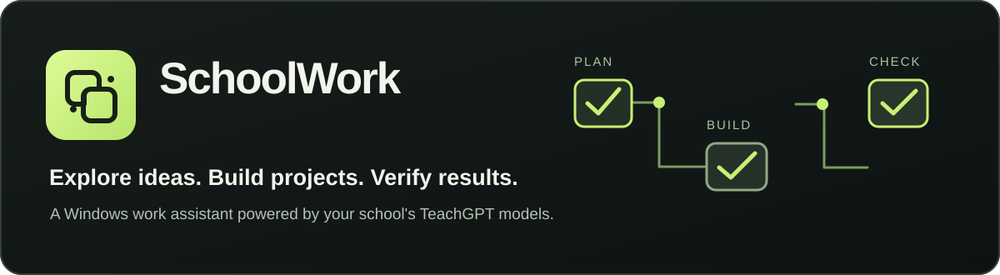
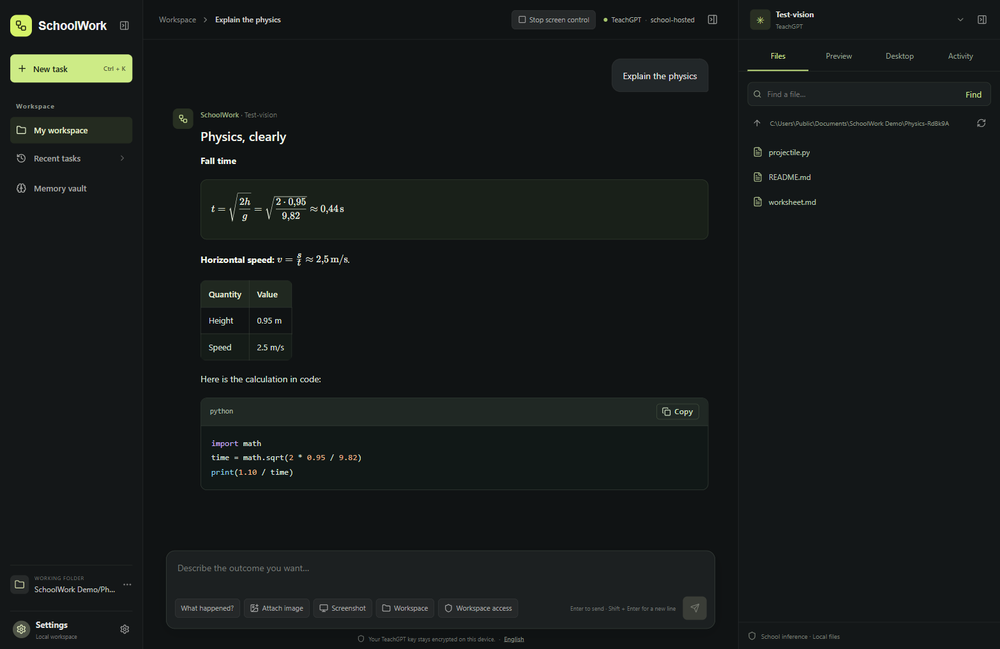
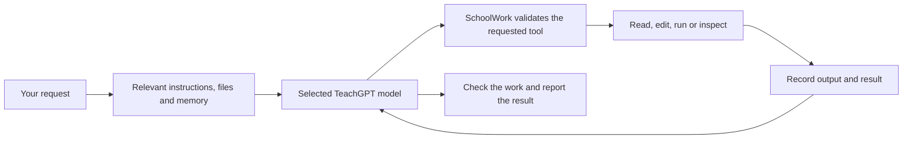
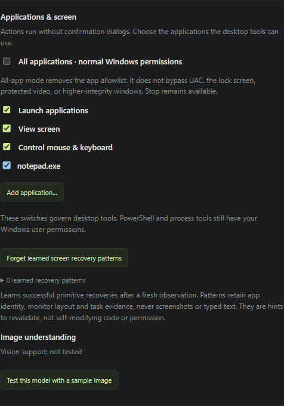
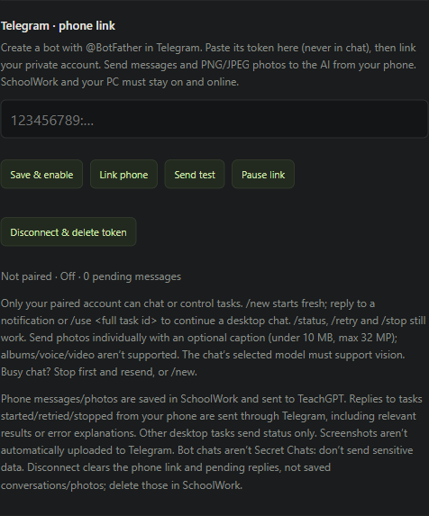

# SchoolWork



<p align="center"><strong>Your ideas, your computer, your school's AI models.</strong></p>

<p align="center">
  <a href="https://github.com/SILLEN69/schoolwork-desktop/releases/latest"></a>
  
  
</p>

<p align="center"><a href="https://github.com/SILLEN69/schoolwork-desktop/releases/latest"><strong>Download v0.7.0</strong></a> · <a href="#first-time-setup">Get started</a> · <a href="#what-schoolwork-can-do">Features</a> · <a href="#screen-control-see-act-check">Screen control</a> · <a href="#talk-to-schoolwork-from-your-phone">Telegram</a></p>

SchoolWork is a Windows assistant for students and teachers with access to **TeachGPT at Stockholm Science and Innovation School (SSIS)**. Explain a concept, investigate a bug or build a project: SchoolWork helps the selected school model find relevant files, edit code, run tests and report what happened. Your conversations and Markdown memory stay on your computer; model requests go to TeachGPT.

**Current release: v0.7.0 for Windows x64.** It includes the screen, image and Telegram features shown below. Every installation needs its own eligible TeachGPT account and API key. SchoolWork is an independent open-source project, not an official school application.

The 0.7 release adds bounded observation loops, one-call memory saves, chronological chat and actual task-specific Telegram replies. Its one-time upgrade migration enables application launching, screen viewing and input; later user revocations stay saved. See [0.7 implementation and verification](docs/agent-efficiency-0.7.md).

**[Installer and portable downloads](https://github.com/SILLEN69/schoolwork-desktop/releases/tag/v0.7.0)** · **[Installation script](Install-SchoolWork.ps1)** · **[Source setup](#run-the-latest-source)** · **[Report a problem](https://github.com/SILLEN69/schoolwork-desktop/issues)**



*The 0.6.0 interface, captured from the real application using an isolated demo profile and a simulated model reply. Screenshots contain no student records or real credentials; they illustrate the interface, not a live model benchmark. Version 0.7 interleaves progress updates and tool activity in the central chat.*

## For the classroom

| If you are… | Try SchoolWork for… |
|---|---|
| Learning to code | Understanding an existing project, locating a bug, making a small change and running its tests. |
| Studying maths or science | Asking for an explanation, checking units and comparing a calculation with a short program. SchoolWork renders equations and accepts images with a vision-capable model. |
| Building a school project | Turning a brief into milestones, editing several files, starting a local website and checking its behaviour. |
| Preparing a lesson | Drafting exercises, explanations, example code or a small interactive demonstration to review before class. |
| Supervising project work | Reviewing visible tool activity, test output and changed files alongside the student's explanation of their work. |

Use it according to your teacher's rules for AI assistance. Ask for explanations and check the work: a confident answer or a passing syntax check is not proof that an entire project is correct. Start with a copy of a project and avoid identifiable student records or confidential assessments.

## What SchoolWork can do

| Work | Available in v0.7.0 |
|---|---|
| **Ask and explain** | Swedish or English conversations, selected TeachGPT models, rendered equations, tables and highlighted code. |
| **Build and debug** | Project mapping, file search, bounded reads, targeted edits, backups, real test commands and local website checks. |
| **Keep context** | Saved tasks, progress timers, checkpoints and a local linked Markdown memory vault. |
| **Use your desktop** | Windows app/window inspection, point-in-time screenshots, monitor selection, mouse and keyboard actions. |
| **Show a problem** | PNG/JPEG attachments, screenshot questions and a per-model vision test. Image understanding depends on the selected model. |
| **Continue by phone** | Optional paired Telegram bot for messages, individual photos, task updates and stop/retry commands while the PC is on. |

Model availability comes from your TeachGPT account. Displayed Artificial Analysis rankings are a dated reference where a matching model exists, not a live leaderboard or a guarantee of coding ability. School-hosted settings can differ from benchmark settings. SchoolWork keeps the model you choose; it does not silently switch providers or buy API credits.

## Install on Windows

### Option 1 — Download the installer

1. Open **[Releases](https://github.com/SILLEN69/schoolwork-desktop/releases/latest)**.
2. Download the file ending in **`-x64-setup.exe`** and run the interactive installer. The supported distribution target is Windows x64; Windows 11 is the intended classroom platform.
3. Start SchoolWork and follow [first-time setup](#first-time-setup).

Current download links:

| File | Purpose |
|---|---|
| [SchoolWork 0.7.0 installer](https://github.com/SILLEN69/schoolwork-desktop/releases/download/v0.7.0/SchoolWork-0.7.0-x64-setup.exe) | Normal per-user installation; no developer tools needed to open the app. |
| [SchoolWork 0.7.0 portable](https://github.com/SILLEN69/schoolwork-desktop/releases/download/v0.7.0/SchoolWork-0.7.0-x64-portable.exe) | Launch without the installation wizard. "Portable" does not mean that all settings and chats stay beside the executable. |
| [SHA-256 checksums](https://github.com/SILLEN69/schoolwork-desktop/releases/download/v0.7.0/SHA256SUMS-v0.7.0.txt) | Compare downloaded files with the published manifest. |

Packages are **unsigned**. On a managed school computer, follow your school's software-installation process if Windows or an administrator blocks them. The app does not require automatic administrator elevation.

### Option 2 — Use the installation script

**[Read the script](Install-SchoolWork.ps1)** or **[download its raw contents](https://raw.githubusercontent.com/SILLEN69/schoolwork-desktop/main/Install-SchoolWork.ps1)**. From a folder you can write to, run:

```powershell
Invoke-WebRequest -Uri "https://raw.githubusercontent.com/SILLEN69/schoolwork-desktop/main/Install-SchoolWork.ps1" -OutFile ".\Install-SchoolWork.ps1"
Get-Content .\Install-SchoolWork.ps1
.\Install-SchoolWork.ps1
```

The script downloads **v0.7.0** by default, verifies the installer against its SHA-256 manifest, then opens the regular installation wizard. Pass `-Version v0.6.0` if you explicitly need the previous release. It does not change PowerShell execution policy. If scripts are blocked, use Option 1 or your school's approved method.

For an update, finish or pause your current work and close SchoolWork normally before running the newer installer. Keep backups of important projects. Downloading source code alone does not update an installed app.

## First-time setup

1. **Get your own TeachGPT key.** Sign in to [TeachGPT](https://teachgpt.ssis.nu/) with your eligible school account, then open [API tokens](https://teachgpt.ssis.nu/user/api-tokens). These pages require school access; downloading SchoolWork does not grant it.
2. **Open Settings in SchoolWork.** Paste the key into **TeachGPT API key** and select **Save**. Put keys in Settings, never in a chat, screenshot or GitHub issue.
3. **Select Refresh available models**, then choose a **Default model** returned by the school. [TeachGPT's model page](https://teachgpt.ssis.nu/about/models) describes its current offering.
4. **Choose a Working folder.** Start with a dedicated lesson/project folder. File tools default to **Selected workspace only**. **Full user access** allows file tools to work elsewhere with your Windows account's permissions; it applies to new tasks.
5. **Review Applications & screen.** New default settings allow all accessible apps, launching, screen viewing and input. Turn off capabilities you do not want, or select specific apps. For image questions, run the sample-image test under **Image understanding**.
6. Choose English or Swedish using the language control, start a new task and give it a small, concrete objective.

Internet is needed for TeachGPT inference. Existing local conversations and files remain available offline. Coding tasks may need additional tools such as Git, npm or Python; SchoolWork can run installed tools, but does not bundle every language, package manager or project dependency. Its `node` process tool uses Electron's bundled Node runtime.

## Your first task

Start with one outcome and describe how to check it. You can write in Swedish or English.

**Learn with an explanation**

> Förklara hur en for-loop fungerar med ett litet Python-exempel. Ge mig sedan en uppgift att lösa själv. Visa inte lösningen förrän jag har försökt.

**Build something you can test**

> In this empty project folder, build a small HTML/CSS/JavaScript flashcard app for Swedish vocabulary. Make a short plan. Add five sample cards, a reveal-answer button and a score counter. Start a local preview and check that revealing an answer and updating the score work. Tell me exactly what you tested.

**Fix a project**

> Map this project and find its test command. Reproduce the failing test, make the smallest relevant change and run the test again. Preserve my existing edits. Explain the cause and show the files you changed.

**Prepare a lesson**

> Create a Markdown worksheet introducing Ohm's law for upper-secondary students. Include a worked example, five practice questions and a separate answer section. Check the numerical answers with code and state the assumptions.

For bigger projects, give the agent milestones and acceptance checks. Review each meaningful result before expanding the scope. SchoolWork improves access to tools and context; it does not make every model equally capable or guarantee completion.

## Follow the work

The left sidebar holds your conversations and **Memory vault**. The centre shows the conversation, current activity and task controls. The right panel offers **Files**, **Preview**, **Desktop** and **Activity**.

- Expand a tool step to see the file operation, command or result. Commands can report output, exit status and errors.
- Use **Files** to explore the project and read bounded excerpts. Use **Preview** for a local website.
- The total stopwatch follows the task; the stage timer follows its current step. Receiving stream data means the provider is active, not that a file has been created or a test has passed.
- **Pause**, **Cancel** and **Retry / resume** let you stop or recover work. Saved tool records help avoid repeating completed operations; check the screen or files after an interrupted action with uncertain effects.
- Progress includes short explanations and observable actions. It is not a live transcript of the model's private reasoning.

### How the agent works



The model chooses an action; the application executes it and sends the result back. For example, a failing test returns an actual error the model can use to revise its edit. Streaming keeps long replies moving through the school gateway. Incomplete streamed tool arguments are not executed. Provider errors can still occur, and a retry cannot repair an unavailable school server.

## Screen control: see, act, check

**Included in v0.6.0.**

SchoolWork can use ordinary Windows applications through its bundled desktop helper. It can list and launch apps, find and focus windows, read accessible controls, capture a window or monitor, move windows between monitors, click/double-click, type Unicode text, press shortcuts and scroll.

In 0.7, the requested full-desktop policy enables all applications/launching/view/input once on upgrade, including unfinished task snapshots. This migration never repeats on restart. **Stop screen control** disables input and pauses active work; only the user can enable it again. The AI can use `release_screen_control` to relinquish input for its task without disabling other tools or future tasks. All schemas remain registered even when execution is blocked by revocation. The central chat interleaves updates and tool steps, with the final answer after its tools.



*Real settings from the isolated demo profile. This example uses selected-app access; a fresh default profile uses all-app access.*

### Try a small desktop task

1. Open **Settings → Applications & screen**. Choose all-app access or turn it off and use **Add application…** to select an ordinary app you are comfortable testing.
2. Enable **Launch applications**, **View screen** and **Control mouse & keyboard** as needed. For visual reasoning, test the selected model's image support first.
3. Open a blank document and ask: **“Find the blank Notepad window, type a three-item revision checklist, then inspect the window and tell me whether the text is there.”**
4. Follow the **Desktop** panel and activity. Avoid changing the target window or using the mouse/keyboard during the action.
5. Use **Stop screen control** or **Ctrl+Alt+Escape** to stop desktop interaction immediately. Re-enable the relevant controls in Settings when you want to use it again.

For each input action, the agent must first capture a fresh, window-specific observation. The app checks window identity, position and focus before applying input. That observation is single-use and expires after three minutes; the agent must observe again after acting. This helps prevent typing into a window that has changed since the last screenshot.

Screen viewing is **point-in-time capture**, not continuous video. UI Automation provides text from accessible controls; interpreting pixels requires a vision-capable TeachGPT model. The image test checks a synthetic picture, not your personal screen. Text-only models can use available control text but cannot be assumed to understand screenshots.

Desktop actions share your real mouse, keyboard and windows and run without per-action confirmation dialogs. They cannot bypass UAC, a locked desktop or Windows privilege restrictions. Minimized, covered, protected or elevated windows may not work as expected. If Windows refuses focus, activate the intended window yourself. Stopping control leaves the applications open; an interrupted input may already have had a partial effect.

## Images, equations and code

SchoolWork supports PNG/JPEG through the image picker, clipboard paste or drag-and-drop. You can ask about an error screenshot, a diagram or a photographed exercise. Attach only what you intend to send to TeachGPT.

- Up to six images per desktop message; originals are limited to 10 MB and 32 megapixels each, with an 8 MB combined normalized limit.
- Images are resized locally to a maximum 1,600-pixel side and re-encoded. Older image-bearing messages may be omitted from model context with a notice; reattach a needed image when appropriate.
- Photos require image support on the selected school model. Unsupported input produces an error instead of silently changing the model.
- Maths uses LaTeX rendering; fenced code has highlighting and a Copy button. Tables, lists and code remain part of the saved conversation.

An uploaded screenshot and an agent screenshot have different lifetimes: user attachments stay with the saved chat until deletion; agent tool screenshots are transient. A screenshot attached using a capture button is a normal saved attachment. Screenshots sent to the model can contain other visible windows, so clear unrelated sensitive content first.

## Memory you can read and edit

Open **Memory vault** to search, read and edit local Markdown notes. Notes can link to one another with `[[wikilinks]]`; the graph shows those explicit links. You can archive or forget a note, and **Open vault folder** lets you use the same files in Obsidian. Obsidian is optional.

Memory records project context and observations from previous work. Failed attempts can become provisional lessons; recorded successful checks can support a more specific remedy. In 0.6.0, desktop recovery patterns also keep bounded evidence of failures followed by successful actions and fresh observations. You can clear those patterns in Settings.

This is stored knowledge, **not training the school model's weights**. Notes can be incomplete or outdated and should be checked against the current project. They do not grant tool permissions. Forgetting a memory is separate from deleting its original conversation. The vault contains ordinary local files, not encrypted secret storage.

## Talk to SchoolWork from your phone

**Optional in v0.6.0.** Telegram lets you send messages or individual photos, receive replies and task notifications, and check or stop work from your phone. The PC must stay awake and online with SchoolWork running. There is no mobile SchoolWork app or public server to host, but you do need to create a Telegram bot once.



1. In Telegram, use the official **[@BotFather](https://t.me/BotFather)** account to create your own bot with `/newbot`.
2. Paste its token into **SchoolWork Settings → Telegram → bot token**, then select **Save & enable**. Never send that token in an AI chat.
3. Select **Link phone**, open the link in Telegram and press **Start**. The one-time link expires after five minutes.
4. Use **Send test**, then send a normal message to your bot. Only the paired private chat and sender can submit or control work.

| Telegram action | What it does |
|---|---|
| Normal message | Starts or continues the selected saved conversation. |
| One PNG/JPEG photo, with an optional caption | Sends an image question to the conversation's model; vision support is required. |
| `/status` | Reports the selected conversation's latest work task, or the latest desktop task before one is selected. |
| `/retry` | Resumes eligible saved work with its existing model and progress. |
| `/stop` | Stops the targeted task. |
| `/new` | Starts a fresh conversation; it does not stop earlier work. |
| Reply to a notification, or `/use <full task UUID>` | Continues the associated desktop conversation. |

If a chat is busy, stop then resend, or start `/new`; messages are not silently inserted into a running tool step. Voice messages, albums, video and non-image documents are not supported. This is Telegram integration, not WhatsApp or a voice-call feature.

Paired phone delivery includes the actual fresh final answer from desktop and phone tasks: action results are short, while questions receive the explanation they need. Task IDs stay in button/reply routing instead of visible boilerplate. These replies can contain requested results and private content; do not use the link for sensitive work. Screenshots are not automatically sent to Telegram. Bot conversations are Telegram cloud chats, not end-to-end encrypted Secret Chats. **Pause link** pauses the connection; **Disconnect** removes the token, pairing and queued replies, but neither deletes existing conversations nor stops already accepted local tasks. See [Telegram details and verification limits](docs/telegram-chat.md).

## Data, permissions and school use

| Data or action | Where it goes / what it can access |
|---|---|
| Prompts, relevant file excerpts and retrieved memory | Sent to the configured school TeachGPT service for inference. Local storage does not mean offline inference. |
| Image attachments and model-requested screenshots | Sent to TeachGPT when used as image context. Model/tool support and school service policies apply. |
| Conversations, task history, attachments and memory | Stored under the local SchoolWork app-data profile, normally `%APPDATA%\schoolwork-desktop`. These are not all encrypted. |
| TeachGPT key and optional Telegram token | Stored through Electron's Windows-protected credential storage. Every user supplies their own credentials. |
| Web searches and opened links | Contact search providers/websites, independently of TeachGPT. |
| Telegram messages, photos and replies | Pass through Telegram as well as TeachGPT where inference is required. |
| File tools | Start within the chosen workspace, or use Full user access when selected. Credential files are excluded by built-in filtering, not a guarantee that every possible secret will be detected. |
| Commands and desktop input | Run with your Windows user's permissions. Folder limits and capability switches are **not an operating-system security sandbox**. |

Ask your school which data may be sent to TeachGPT or Telegram and what its retention rules are. SchoolWork cannot promise a school's server policy or that data is never used for training. For classroom adoption, have a teacher or IT administrator review the app and start with non-sensitive demo projects. There is no classroom administration console, managed student roster or institutional deployment policy built in.

## If something goes wrong

| Symptom | What to try |
|---|---|
| No models or authentication error | Check your own key in Settings and refresh the list. Confirm your TeachGPT account can access the service. |
| HTTP 504, a long wait or an interrupted stream | Let the current attempt settle; use the saved Retry / resume control. Check TeachGPT availability and try a smaller task/context if it repeats. Stream activity is not a completion check. |
| “Path is outside the selected workspace” | Select the intended folder, or choose Full user access for a new task if appropriate. |
| `node`, `npm`, `git` or `python` not found | Check which runtime/package manager the project requires. The tool's bundled Node support does not include every other executable. |
| PowerShell blocks the install script | Download the `.exe` directly or use the school-approved install route; changing policy is not required by SchoolWork. |
| Screen input is refused or the observation expired | Keep the intended window visible and active, inspect capability settings, and let the agent take a fresh screenshot. |
| Images fail | Test vision in Settings with the selected model. A model identifier is not proof of image support. |
| Telegram is silent | Check PC sleep/network, SchoolWork is open, pairing, and whether the link is paused. Use Send test. |
| A feature is absent | Check the version in your installation against the [latest release](https://github.com/SILLEN69/schoolwork-desktop/releases/latest). |

For a bug report, use [GitHub Issues](https://github.com/SILLEN69/schoolwork-desktop/issues). Include your app version, Windows version, model ID, steps, expected result and actual error. Review diagnostic exports and screenshots before sharing; do not include keys, `.env`, student records or private project files.

## Run the latest source

For developers or school IT building and checking the application from source:

**Requirements:** Windows x64, Git, Node.js **22.12 or later** with npm, and Windows .NET Framework 4.x with its x64 C# compiler. The build compiles the small desktop helper locally. Opening the released installer does not require this developer setup.

```powershell
git clone https://github.com/SILLEN69/schoolwork-desktop.git
cd schoolwork-desktop
npm ci
npm run dev:app
```

`dev:app` builds the frontend, backend and Windows helper before starting Electron and Vite. Configure your TeachGPT key in Settings. `npm run dev` alone is only a browser preview and cannot run local file, process or desktop tools.

```powershell
# Unit tests
npm test

# Production application and native helper
npm run build
npm start

# Windows integration checks with simulated provider traffic
# Run on an awake, unlocked desktop; a disposable window receives input.
npm run test:desktop

# Build installer and portable executable in release/
npm run package:win
```

For testing without touching your normal profile, create an empty directory and pass its absolute path via `--user-data-dir=<directory>` when launching the Electron app. Keep real credentials out of test profiles. Local packaging does not publish a release or change the installation script's pinned version.

### Verification and contributing

Tests cover provider recovery, tool execution, storage, image transport, desktop observation checks and Telegram routing. Integration tests with simulated transports do **not** establish live TeachGPT vision quality or real Telegram delivery. Mixed-monitor scaling and third-party apps need additional manual checks. The existing [desktop](docs/desktop-implementation.md), [agent](docs/agent-upgrade.md) and [Telegram](docs/telegram-chat.md) reports describe their dated verification scope; older design notes are not the current release catalogue.

Contributions should include a focused reproduction, a small change and the relevant checks. Keep keys, `.env` files, local conversations, browser profiles and private logs out of commits. See [image provenance](docs/images/README.md) for the screenshots used here.

**Not currently a built-in workflow:** voice conversation, image/video generation, WhatsApp, cloud sync, scheduled classroom work, or a complete Office/PDF creation-and-rendering pipeline. Installing other tools or controlling a desktop application is not the same as a verified native integration.

## License

SchoolWork's original source is available under the [MIT License](LICENSE). TeachGPT access and model availability are provided separately by the school. This independent project does not redistribute model weights or claim endorsement by a school, TeachGPT, Telegram, OpenAI or Microsoft.
